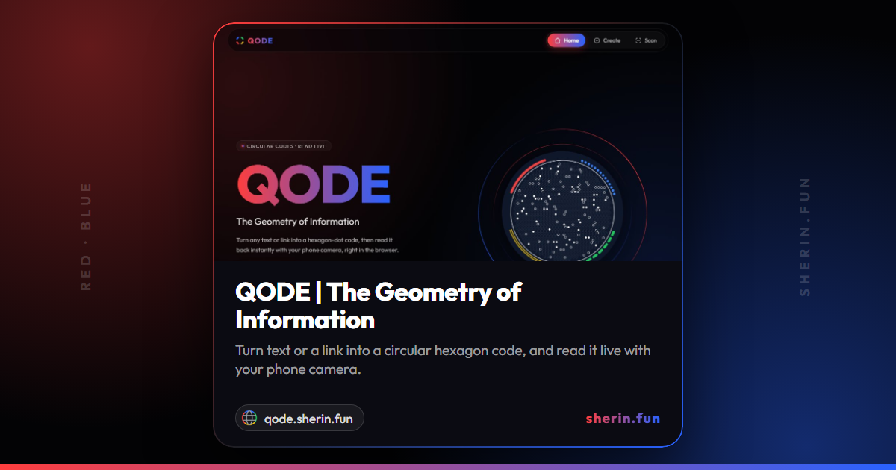

<div align="center">

<!-- HEADER -->


<!-- BADGES (SIGNATURE ORDER) -->
<p>
  
  
  
  
</p>

<strong style="color:#94a3b8;">Live link-preview images for every sherin.fun project, in the Red-Blue signature style.</strong>

<br/>

</div>

---

<!-- ABOUT -->


**OG** turns any page on `sherin.fun` into the image that shows up when the link is shared on WhatsApp, LinkedIn, X, Discord, Slack or Teams.

It opens the page in a real browser, takes a screenshot, and lays it out in a **1200×630 card**:

- a live **screenshot** of the page on top of a rounded card with a red→blue edge
- the page's own **title**, **description** and **icon** underneath
- red and blue glows, a gradient line along the bottom and the **sherin.fun** signature

Everything that matters sits in the **middle square** of the image, so the card stays whole in the square crop that WhatsApp and iMessage use, and in the wide previews of LinkedIn, X, Discord and Slack.

Because the card is made from the live page, the preview is never out of date.

<div align="center">



</div>

---

<!-- EVERY PLATFORM -->


Apps show link previews in different shapes. LinkedIn, X, Discord and Slack use the **wide banner**; WhatsApp and iMessage often cut out a **square from the middle**. The card is built so both look complete:

<div align="center">


</div>

---

<!-- FEATURES -->


### 🚀 Core Features

- **Always current**  
  The card is built from a fresh screenshot of the real page.

- **Reads the page for you**  
  Uses `og:title` / `og:description` when present, otherwise the page title and description.

- **Fast for crawlers**  
  Every card is cached on disk for 24 hours, so repeat requests return in a fraction of a second.

- **Locked to our sites**  
  Only `https://` addresses on `sherin.fun` and its subdomains are accepted, including after redirects.

- **Gentle on the server**  
  At most two pages render at the same time; identical requests share one render.

---

<!-- USAGE -->


Point a page's `og:image` at the service with the page's own address (URL-encoded):

```html
<meta property="og:title" content="QODE | The Geometry of Information">
<meta property="og:description" content="Turn text or a link into a circular hexagon code.">
<meta property="og:image" content="https://og.sherin.fun/og?url=https%3A%2F%2Fqode.sherin.fun%2F">
<meta property="og:image:width" content="1200">
<meta property="og:image:height" content="630">
<meta name="twitter:card" content="summary_large_image">
<meta name="twitter:image" content="https://og.sherin.fun/og?url=https%3A%2F%2Fqode.sherin.fun%2F">
```

Changed the page and want a new preview before the cache expires? Add a version: `...&v=2`.

---

<!-- API -->


| Request | Result |
| :--- | :--- |
| **`GET /og?url=<page>`** | 1200×630 PNG preview card for that page. |
| **`GET /og?url=<page>&v=<n>`** | Same, skipping the cached copy (new version). |
| **`GET /`** | Small page with an example card. |

| Setting | Default | What it does |
| :--- | :--- | :--- |
| **`PORT`** | `3003` | Port the server listens on (localhost only; Nginx sits in front). |
| **`CACHE_HOURS`** | `24` | How long a card is reused before it is made again. |

---

<!-- RUN LOCALLY -->


```bash
npm install
npx playwright install chromium
npm start
```

Then open `http://localhost:3003/og?url=https://qode.sherin.fun/`.

On a fresh Linux server, install Chromium's system libraries once with `sudo npx playwright install-deps chromium`.

---

<!-- USED BY -->


- 👉 **https://qode.sherin.fun**: QODE, circular hexagon codes
- 👉 **https://app.sherin.fun**: Red-Blue, full-stack demo app

_The portfolio at **sherin.fun** keeps its own hand-made preview image._

---

<!-- LICENSE -->


This project is licensed under the **Red-Blue-co License**.

---

## Author

**Sherin Varghese**, software engineer in Berlin

- Website and portfolio: [sherin.fun](https://sherin.fun)
- GitHub: [@Sherin-V](https://github.com/Sherin-V)
- LinkedIn: [Sherin Varghese](https://www.linkedin.com/in/sherin-varghese-04b6831ba/)
- Email: [admin@sherin.fun](mailto:admin@sherin.fun)


<div align="center">


<!-- FOOTER -->


</div>
